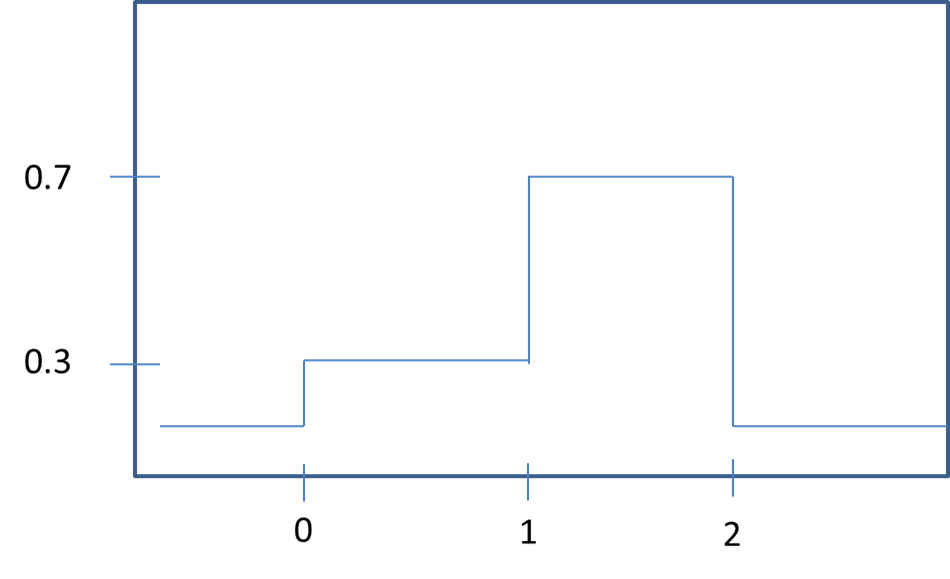
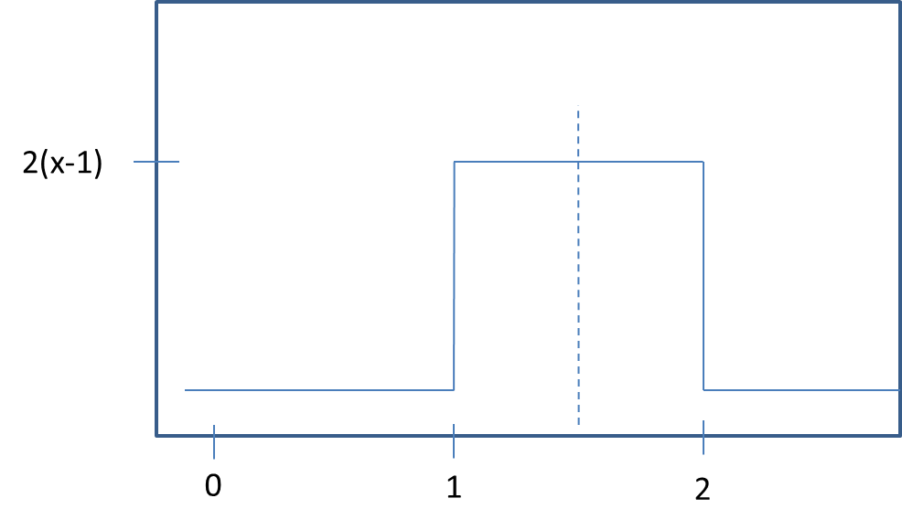
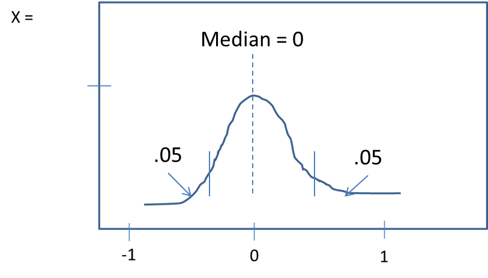

```{r setup, include=FALSE}
knitr::opts_chunk$set(echo = TRUE)
```

## R Markdown

1.  Find the Median and Expected Value of the following pdf: 


$f(x) = \begin{Bmatrix}$
$0.3 & 0 < x < 1\\$
$0.7 & 1 \leq x < 2\\$
$0 & otherwise$
$\end{Bmatrix}$


a.  *MEDIAN*. The median of the pdf is the .5 quantile of the pdf. The area from [0,1] = .3 (H*W).  The area between 1 and q2  is a rectangle with area .2 and HT .7 and base qt.  This gives us the equation of $.7qt= .2$,  $qt= .2/.7$,  therefore $qt= .28$

b. *EXPECTED VALUE.* The expected value of the pdf = 
$\frac{a+b}{2}$, $\frac{.3*1 + .7*1}{2}$ = $\frac{1}{2} = .5$



2.Trosset 6.4 Ex. 1.  Refer to the random variable X defined in Exercise 5.6.2. Compute the following two quantities: $q2(X)$, the population median; and $iqr(X)$, the population interquartile range.

$f(x) = \begin{Bmatrix}$
$0 & if x < 1\\$
$2(x-1) & if 1 \leq x \leq 2\\$
$0 & if x > 2$
$\end{Bmatrix}$

a. *MEDIAN.*   Because this is a uniform random variable, we can use the property of symmetry.  Because the pdf is symmetrical, the Median and Expected Value are the same value.  The Median (and $E(X)$) = 
$\frac{1+2}{2} = 1.5$

B. *IQR.*  The IQR = $q3 - q1$, $1.75 - 1.25 = 0.5$



3.  Trosset 6.4 Ex 7: 

a. **TRUE** With symmetric variables, q1 and q3 are symmetric about 0
		
b. **FALSE** The IQR contains roughly 50% of the values of the distribution.  One SD contains approximately 67% of the values (for normal distributions). 
		
c. **FALSE** Because the IQR and median are not sensitive to outliers and the Mean is, in distributions that have extreme outliers, the q1 and q3 values will be less affected than the mean. It is possible for highly skewed distributions to have a mean outside the IQR. 
		
d. **TRUE** If there the standard deviation of a variable is equal to zero, then there is no deviation in the observations, and thus $q1$ and $q3$ will be the same, the difference of which will equal zero. 

e. **FALSE** While often true, having the same median and expected values does not always indicate symmetry. For instance, a distribution where the observations are $(0, 0 ,5, 10, 10)$ would have both a median and expected value of 5 while not being symmetric. 


4.  Health Food Store Problem.  Mean given as 85, Standard Deviation given as 5, and we're trying to find the amount of granola that would represent the lowest 2.5% of values in pounds. To find this, we can use the ``qnorm`` function in R.

```{r prob_4}
qnorm(.025, 85, 5)
```
If demand drops at or below 75.2 pounds of granola during the week, the manager will order less granola the following week. 

5.  Lulu's CCQ Score.  Here, we have the quantile value $1/1,000,000 = .99999$ and need to find the CCQ score of the top .999999 percentile, given a Mean of 100 and Standard Deviation of 400.  We can again use the qnorm function by passing in the values: 

```{r prob_5}
qnorm(.999999, 100, 400)
```

Lulu's CCQ score is 2001.37.  *I was confused by a normal distribution having a mean of 100 and SD of 400 - this seems like it would be very flat when graphed? The z-score here of 2001 seems high considering a mean of 400*

6.  x is a standard normal distribution, and $Y = x^2$ Find the .9-quantile of Y, or $P(y < q) = 0.9$
In the normal distribution, the quantile for the area under the graph we need initially = .9. 




Which gives the equation $P(\sqrt{-q} < x \leq \sqrt{q})$.  
Because the values less than zero or $P(\sqrt{-q}$ are negative infinity, we can drop this from the equation and attempt to solve for $P(x \leq \sqrt{q}) = .95$, which we can find in R as ``pnorm(sqrt(q))`` = .95. Because we know that the area under the graph is .95, we can use the inverse function ``qnorm(.95)`` to find the square root of q.  

```{r prob_6}
qnorm(.95)
```

Thus the square root of $q = 1.644854$.  
$q = 1.644854^2 = 2.705543$
